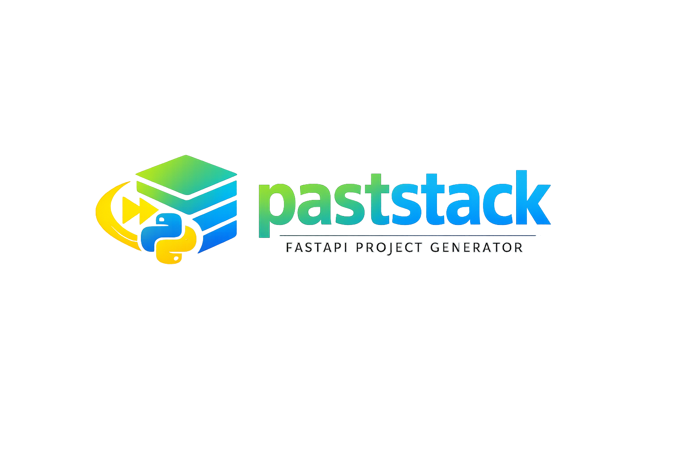

# paststack



A CLI to generate production-ready FastAPI backends with a clean, opinionated architecture.


---

## Vue d’ensemble

**paststack** génère un projet prêt au développement : arborescence `src/app/` (core, api, routes, models, schemas), configuration **pydantic-settings**, CORS, santé `/health` et `/ready`.

Décisions actuelles de la v1 :

| Sujet                   | Choix                                                                                                                             |
| ----------------------- | --------------------------------------------------------------------------------------------------------------------------------- |
| Gestionnaire de paquets | **uv**                                                                                                                            |
| Base de données         | **none**, **SQLite**, **PostgreSQL**                                                                                              |
| Couche données          | **sans ORM** (driver async) ou **SQLModel** (ORM unique)                                                                          |
| Rate limiting           | **slowapi** (optionnel), limite par IP                                                                                            |
| PostgreSQL              | **docker-compose** fourni ; URL alignée sur le conteneur                                                                          |
| Dépendances             | **extras** dans le `pyproject.toml` généré (`sqlite-none`, `sqlite-sqlmodel`, `postgres-none`, `postgres-sqlmodel`, `rate-limit`) |
| Git                     | `git init` optionnel                                                                                                              |
| Messages de commit      | **[git-z](https://github.com/ejpcmac/git-z)** optionnel (`git z init` dans le projet généré)                                      |

---

## Fonctionnalités

- Assistant interactif (`questionary`) : nom du projet, CORS, base, ORM, rate limiting, installation `uv`, git, git-z
- Copie des templates embarqués dans le package (`templates/**/*`)
- Création d’un venv + `uv sync` avec les bons `--extra` si demandé

---

## Utilisation

Une fois le package installé (`pip install paststack` depuis PyPI, ou `uv pip install -e .` depuis ce dépôt) :

```bash
paststack
```

Puis ouvrir le dossier créé, copier `.env.example` vers `.env`, lancer l’API (voir le `README.md` généré dans le projet).

### Développement (ce dépôt)

```bash
git clone https://github.com/initd-fr/paststack.git
cd paststack
uv sync
uv pip install -e .
paststack
```

### Qualité (ce dépôt)

```bash
uv run ruff check .
uv run mypy .
```

### Tests (ce dépôt)

```bash
uv sync --group dev
uv run pytest tests/ -v
```

Les combinaisons valides (SGBD × ORM × rate limiting) sont exposées dans `paststack.combinations` pour les tests ou un usage programmatique.

---

## Conventions de commit (ce dépôt)

Format décrit dans `git-z.toml` : `TYPE description (scope)` (types et scopes listés dans le fichier).

Pour utiliser l’assistant [git-z](https://github.com/ejpcmac/git-z) en local : `git z init` (après installation de l’outil). Le générateur peut lancer `git z init` dans le **nouveau** projet si tu coches l’option correspondante.

---

## Feuille de route (indicative)

### v0.x — générateur actuel

- [x] CLI interactive + modèle `Project` typé
- [x] Template FastAPI (`core`, `api`, routes, models, schemas)
- [x] SQLite / Postgres × ORM ou driver seul
- [x] Rate limiting (slowapi) en option
- [x] Venv + `uv sync` avec extras
- [x] `git init` / `git z init` en option

### Plus tard

- Variantes d’architecture (minimal / modulable avancée), autres SGBD, observabilité, etc.

---

## Pourquoi ce projet

Poser une base FastAPI propre (structure, typing, lint, DB) prend du temps. Ce CLI applique les mêmes défauts à chaque nouveau service.

## Licence

MIT
